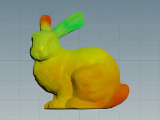

houdini-spectral-geometry-processing
===

This is a reference implementation of ["Spectral Geometry Processing with Manifold Harmonics"](https://inria.hal.science/inria-00186931/document) using Houdini.

The following features are available:
- Preview of manifold harmonics transform.
- Visualization of eigenvector.




# How to setup
To run it, you need to install `scipy` which matches your Houdini version.

For example, the version of `numpy` included in Houdini 21.0 is `1.26.4`.
So that the version of `scipy` must be `1.12.0`.

```
# houdini.env
PYTHONPATH = $HOUDINI_USER_PREF_DIR\python\site-packages
```

```powershell
cd $env:HOUDINI_USER_PREF_DIR
hython -m pip install scipy=1.12.0 -t python\site-packages
```
